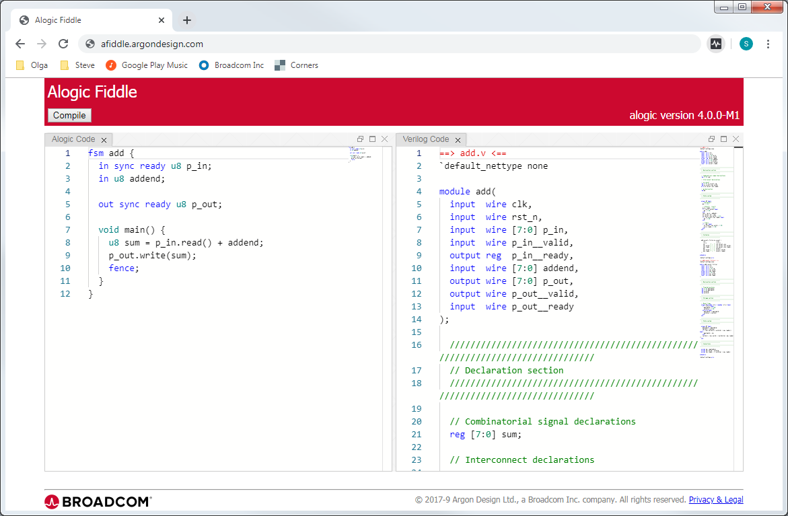

Afiddle
=======

Afiddle is a 'fiddle' for the **Alogic** mid-level hardware design language. It allows the user to enter Alogic code in a browser editor window and immediately see the Verilog that is produced by the Alogic compiler.

Alogic is a mid-level hardware design language developed by Argon Design. It sits between HLS languages like Catapult C or BlueSpec and low-level languages like Verilog and VHDL. It provides abstraction of standard data flow structures used between modules and in pipelines and simplifies writing state machines, but maintains the explicit nature of a low-level language, where the user knows exactly what is being synthesised. See the [Alogic Web Page](https://github.com/ArgonDesign/alogic).

Afiddle comprises a web server written in node.js that serves HTML and client-side Javascript for the fiddle page. The Alogic compiler, which is written in Scala runs on the server. The client uses [Golden Layout](http://golden-layout.com/) and the [Microsoft Visual Studio Monaco text editor](https://github.com/Microsoft/monaco-editor). 

 

Installation and Set-up
-----------------------

The following packages must be installed to build the server:

1. node.js and npm (http://nodejs.org/)
   On Ubuntu/Debian try: `sudo apt-get install nodejs npm`

2. git (https://git-scm.com/)
   On Ubuntu/Debian try: `sudo apt-get install git`

3. sbt (http://www.scala-sbt.org/)
   This is the Scala build tool and development environment
   On Ubuntu/Debian try: `sudo apt-get install sbt`

Then to download and install afiddle and its dependencies:

```
$ git clone https://github.com/ArgonDesign/afiddle
$ make
```

Once built, the server can be run by executing *app.js*, either with `./app.js`, `node app.js` or `npm start`. The server operates on `localhost:8000`. We usually expose the server to the outside world using [ngrok](https://ngrok.com/). The shell script `run.sh` can be used to start both ngrok and the server.

The server uses a directory `runpen` to store user-entered code in files for the Alogic compiler to work on. There is also a directory `logs` for log files. The locations of these directories and the port that the server uses can be set by constants at the top of the apps.js file.

Endpoints
---------

The main server endpoint is `\`. This serves the HTML for the page which pulls in the CSS and Javascript code.

The endpoint `\compile` is used to submit an Alogic file for compilation. The client side code POSTs to this with the Alogic source. The data type must be `text/alogic`. The server responds with text which is either the Verilog results or a list of errors. In either case the results are suitable to be directly displayed in the right-hand-side fiddle window. If the compilation generates multiple Verilog files, they are concatenated with a ==>FILENAME<== before each file, in the same way as `tail`.

The endpoint `\privacy` serves a web page with privacy information.

Tour of Files
-------------

| Directory/file   | Description |
|------------------|-------------|
|static/           | Static files served to the client. Contains HTML files and subdirectories for `css`, `images` and `js` files. Look particularly at the main page HTML, `index.html` and the main client-side Javascript, `js/index.js` |
|test/             | Short Alogic files used in testing |
|alogic*           | Script to run Alogic compiler. Also used as `./alogic update` to install/update Alogic from Github |
|app.js            | Main code of afiddle server |
|bower.json        | Control file for `bower` which installs/updates client side Javascript libraries. Contains the names and version numbers of all the libraries used. Libraries are downloaded to the directory `bower_components`.
|LICENSE           | Details of license for afiddle. It is licensed under the BSD 3-clause license with attribution (https://spdx.org/licenses/BSD-3-Clause-Attribution.html) | 
|Makefile          | Build file using `make` |
|package.json      | Control file for Node package manager `npm`. Contains the names and version numbers of all the packages used. Packages are downloaded to the directory `node_modules`. Note that the Monaco editor is downloaded as a package, but is actually used as a client-side library |
|README.md         | This file |
|run.sh*           | Shell script to start both the server and an `ngrok` session to tunnel it to a public web address |
|screenshot.png    | Screenshot used in this README |

Directories created during installation and in operation:

| Directory/file   | Description |
|------------------|-------------|
|node_modules\     | Node.js packages used by server |
|bower_components\ | Javascript libraries used by client-side code |
|alogic_install\   | Directory where the Alogic compiler is installed |
|runpen\           | Directory used to store source files entered in the web page so they can be compiled by the Alogic compiler. Each compile request creates a new directory with a 4-digit number, such as `0002`; the number increments with each request. Within this the server  creates an `alogic` subdirectory and a `verilog` subdirectory. The source code is then stored as `input.alogic` in the `alogic` directory. Once the compilation is completed, the numbered directory is deleted |
|logs\             | Server log files. Logs are stored in a 5-file rotating sequence. |
