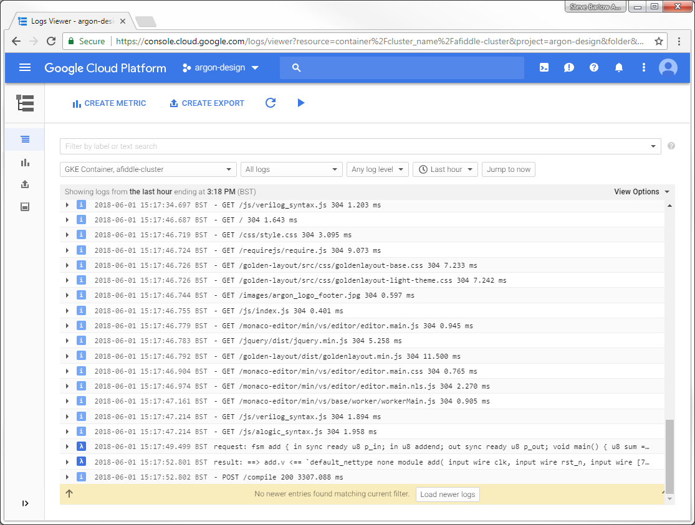

Deploying on Google Cloud
=========================

This note explains how to deploy **afiddle** on Google Cloud. Deploying in the cloud is safer than running on a local machine and exposing that to the Internet.

The deployment takes a Docker image generated by `make dockerbuild` and deploys it on Google Kubernetes Engkine (GKE). The commands below create a cluster with a single node. More nodes can be added seamlessly to change the scale of deployment. Updates to **afiddle** can also be deployed without taking down the service.

Useful websites:

* [1] https://cloud.google.com/kubernetes-engine/docs/tutorials/hello-app
* [2] https://cloud.google.com/docs/authentication/getting-started
* [3] https://cloud.google.com/kubernetes-engine/docs/tutorials/configuring-domain-name-static-ip
* [4] https://cloud.google.com/logging/docs/reference/tools/gcloud-logging
* [5] https://cloud.google.com/sdk/gcloud/reference/ (reference)
* [6] https://kubernetes-v1-4.github.io/docs/user-guide/kubectl/kubectl/ (reference - old but easier to read)

Google Cloud console https://console.cloud.google.com. 

Prerequisites:

1. A valid Docker image for **afiddle**, created by `make dockerbuild` and possibly tested locally with `docker_run.sh`.

2. [Google Cloud SDK](https://cloud.google.com/sdk/docs/quickstarts) installed, which includes the `gcloud` command line tool.

3. Kubernetes command line tool `kubectl` installed using `gcloud components install kubectl`.


Steps
-----

### 1. Tag the Docker Image and push it to Google Cloud

Use `docker tag` to take a copy of the image and name it suitably for uploading to the Google Container Repository. The tag V\<n\> (for instance `V5`) is added to make it easy to later deploy a new version.

The login credentials for Google Cloud need to be set by creating the environment variable `GOOGLE_APPLICATION_CREDENTIALS` pointing to the credentials file. This is obtained as per [2]. The credentials are needed for all subsequent operations.

```bash
$ docker tag afiddle gcr.io/argon-design/afiddle:V<n>
$ export GOOGLE_APPLICATION_CREDENTIALS="/home/sjb/argon-design-47bf86d99dfe.json"
$ gcloud docker -- push gcr.io/argon-design/afiddle:V<n>
```

### 2. Create Cluster

```bash
$ gcloud config set compute/zone europe-west1-b
$ gcloud config set project argon-design
$ gcloud container clusters create afiddle-cluster --num-nodes=1
```

You can see the cluster on the Cloud Console at https://console.cloud.google.com/kubernetes/. The cluster `europe-west1-b` is in Belgium. We prefer trustworthy Europe to the US or Brexity Blighty...

### 3. Reserve an External IP Address

```bash
$ gcloud compute addresses create afiddle-ip --region europe-west1
```

Note the address returned in the command output. We will refer to it as **\<AFIDDLE-IP\>**.

To get info on the IP address subsequently:

```bash
$ gcloud compute addresses describe afiddle-ip --region europe-west1
```

### 4. Deploy the Image to the Cluster

```bash
$ kubectl run afiddle-web --image=gcr.io/argon-design/afiddle:V<n> --port 80
$ kubectl expose deployment afiddle-web --type=LoadBalancer --load-balancer-ip <AFIDDLE-IP> --port 80 --target-port 80
```

You can check the service has been created with `kubectl get service`.

You should now be able to see **Afiddle** in a browser at http://\<AFIDDLE-IP\>.

### 5. Set DNS Record to Point to **\<AFIDDLE-IP\>**

Go to the DNS records for the domain where you want to install **Afiddle** (in our case use the web console for 1&1 Internet) and set the DNS A record for the domain/subdomain to **\<AFIDDLE-IP\>**.


Logs
----

The afiddle image uses Google Cloud Stackdriver for logging. Log messages will appear at `projects/argon-design/logs/afiddle_log
`. The engine will also log **stdout** which appears at `projects/argon-design/logs/afiddle-web`, but this doesn\'t contain anything more than the startup message. You can see which logs exist with the command `gcloud beta logging logs list`.

On the Console, the logs are under `Logging > Logs`. Then select `GKE Container, afiddle-cluster`. Or directly at:

https://console.cloud.google.com/logs/viewer?resource=container%2Fcluster_name%2Fafiddle-cluster




Updating
--------

The pods can be automatically updated (in a rolling fashion if the cluster has more than one node) to a new Docker image.

Tag and upload a new V<n+1> image as per step 1. To see what tag versions are already uploaded, set your credentials as per step 1 and then use `gcloud container images list-tags gcr.io/argon-design/afiddle`.

Then to switch to the new image:

```bash
$ kubectl set image deployment/afiddle-web afiddle-web=gcr.io/argon-design/afiddle:V<n+1>
```

Finally, delete the previous tagged image to avoid it taking up space in the cloud. The best way to do this is from the web console https://console.cloud.google.com/gcr/images/argon-design. If you want to do this from the command line, first get the 12-digit digest of the image you want to delete from `gcloud container images list-tags gcr.io/argon-design/afiddle` and then use `gcloud container images delete --force-delete-tags gcr.io/argon-design/afiddle@sha256:<digest-12-digits>` and confirm with `Y` at the prompt.


Deleting Everything on GCP
--------------------------

Delete the service and wait for the Cloud Load Balancer to be deallocated. Then delete the container cluster and the reserved external IP address.

```bash
# Delete the service:
$ kubectl delete service afiddle-web

# Wait for load balancer to be deleted by polling until <AFIDDLE-IP> is no longer mentioned in:
$ gcloud compute forwarding-rules list

# Delete the container cluster:
$ gcloud container clusters delete afiddle-cluster

# Delete images
# No way of doing this using gcloud without finding all their digest hashes
# Best to do from web console https://console.cloud.google.com/gcr/images/argon-design

# Delete reserved external IP address:
$ gcloud compute addresses delete afiddle-ip --region europe-west1
```
